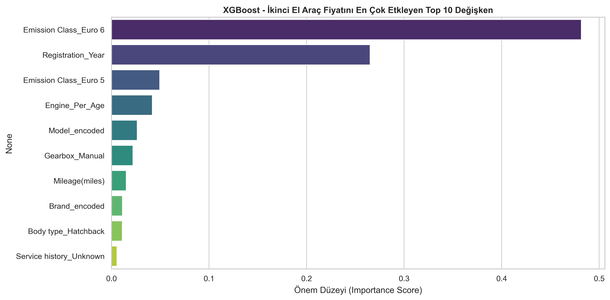

# 🏎️ UK Used Car Price Prediction & Diagnostic Analysis (XGBoost)

An end-to-end Machine Learning project designed to predict second-hand car prices in the UK market using advanced **Feature Engineering**, **Data Hygiene**, **Target Encoding**, and **Gradient Boosting (XGBoost)**.

This project goes beyond standard model training by conducting a thorough **Residual Analysis** and identifying underlying market dynamics (e.g., performance drop in high-end vehicle segments due to missing trim/package data).

---

## 📌 Key Highlights & Methodology

* **Data Hygiene & Imputation:** Addressed non-random missing values in vehicle specifications (`Engine_Size`, `Service history`, `Doors`, `Seats`, `Emission Class`).
* **Domain-Specific Feature Engineering:** 
  * Extracted vehicle `Brand` and `Model` from unstructured titles.
  * Engineered age-based features (`Car_Age`, `Miles_Per_Year`, `Engine_Per_Age`).
* **Data Leakage-Free Target Encoding:** Encoded high-cardinality features (`Brand` & `Model`) strictly within training folds, and applied One-Hot Encoding to low-cardinality categorical variables.
* **Target Transformation:** Applied Log-Transformation (`np.log1p`) to fix right-skewness ($1.38 \rightarrow -0.02$), establishing a near-perfect normal distribution for optimal loss reduction.

---

## 📊 Model Evaluation & Benchmarks

Multiple regression models were evaluated on the test set under identical conditions:

| Model | $R^2$ Score | MAE (£) | Median APE (%) | Status |
| :--- | :---: | :---: | :---: | :---: |
| **XGBoost** | **0.88** | **£785.38** | **~9.98%** | 🏆 Winner |
| LightGBM | 0.88 | £793.42 | 10.56% | Finalist |
| CatBoost | 0.87 | £876.73 | 11.83% | Benchmark |
| Random Forest | 0.86 | £801.29 | 10.57% | Baseline |
| Ridge Regression | 0.80 | £1216.74 | 19.68% | Linear Baseline |

---

## 🔍 Diagnostic Analysis & Model Insights

A detailed post-prediction error analysis revealed critical insights into the model's behavior:

### 1. Actual vs. Predicted Price Analysis
* **Standard Market Alignment (£0 - £15,000):** The model performs exceptionally well on standard market vehicles, aligned tightly along the $y=x$ ideal prediction line with an error margin under **5–7%**.
* **High-End Underestimation (£20,000+):** For vehicles priced above £20,000, the model tends to underestimate the actual value.

### 2. Root Cause Analysis
* **Data Scarcity in High-End Segment:** Premium vehicles constitute a small percentage of the dataset, causing the tree-based model to pull predictions toward the global mean (*regression to the mean*).
* **Missing Feature Signals (Trims/Packages):** Key premium price drivers (e.g., *M-Sport, AMG Line, RS trim packages*) are absent in the dataset, leading the model to evaluate luxury cars using standard specifications.

---

## 📈 Feature Importance

The top features driving predictions according to the trained XGBoost model:



---

## 🛠️ Tech Stack

* **Python 3.10+**
* **Data Manipulation:** `pandas`, `numpy`
* **Machine Learning:** `xgboost`, `lightgbm`, `catboost`, `scikit-learn`
* **Visualization:** `matplotlib`, `seaborn`
* **Model Serialization:** `joblib`

---

## 🚀 How to Run

1. **Clone the repository:**
   ```bash
   git clone [https://github.com/YOUR_USERNAME/UK-Used-Car-Price-Prediction.git](https://github.com/YOUR_USERNAME/UK-Used-Car-Price-Prediction.git)
   cd UK-Used-Car-Price-Prediction
